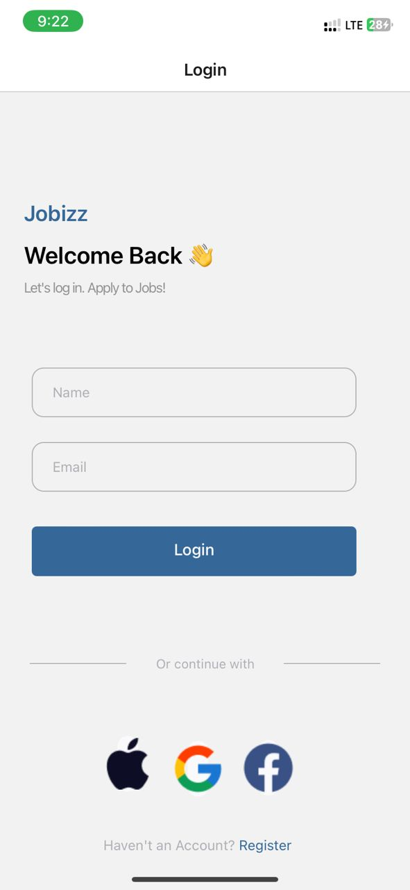
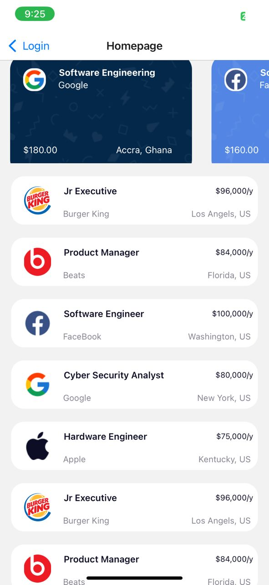

# rn-assignment4-11245046

## 11245046

## Login
The Login component provides a user interface for logging into the app. It includes text elements to display welcoming headers and instructions, two text input fields for the user's name and email, and a login button implemented using `TouchableOpacity`. Additionally, it features a footer section with divider lines and a prompt for alternative login methods using images within `TouchableOpacity` elements, representing social media login options. The component utilizes various styles to ensure a clean and visually appealing layout, with careful attention to text alignment, padding, and color schemes.

## Homepage
The Homepage component serves as the main interface for the app, showcasing user information, a search bar, and job listings. It incorporates a `ScrollView` to allow vertical scrolling and two `FlatList` elements to display featured and popular job listings. User details such as name and email are displayed alongside a profile picture at the top. Below, a search bar with an accompanying search icon and filter box facilitates job searches. The component also includes headers and links for navigating to more detailed job listings. The design relies on a cohesive style, with specific font sizes, colors, and layout rules to maintain consistency and user-friendliness across the interface.

## FeaturedJobCard
The FeaturedJobCard and PopularJob custom components are used within the `FlatList` elements to render individual job listings. The FeaturedJobCard displays featured jobs in a horizontal scrollable view, each card containing an image, location, price, label, and background color. The PopularJob component shows popular jobs in a vertical list, each item detailing the job title, salary, company, location, and an associated icon. Both components are designed to be reusable and maintain consistent styling and structure, contributing to a seamless user experience.

## horizontalData
The horizontalData array contains objects representing data for the featured job listings. Each object includes details such as the image source, job location, price, job label, company name, background color, and text color. This data is used to populate the FeaturedJobCard components, providing a dynamic and scrollable display of featured jobs. The verticalData array provides similar information for popular job listings, containing properties like job title, salary, company, location, and icon source. This array feeds into the PopularJob components, ensuring a comprehensive and user-friendly presentation of job opportunities.

# SCREENSHOTS

## Login Page

## Home Page

